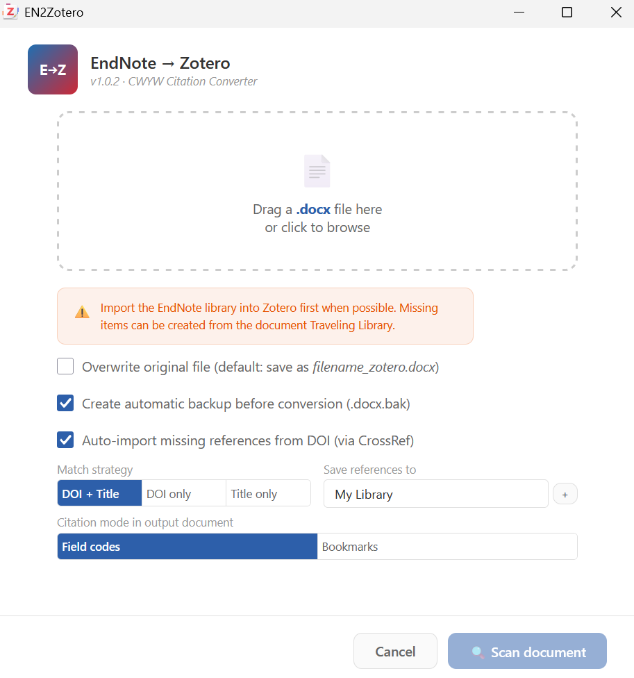

# EN2Zotero

EN2Zotero converts EndNote Cite While You Write citations in Word documents into native Zotero citations. It lets you migrate a manuscript without rebuilding every citation by hand.



## What it does

- Reads EndNote fields and the Traveling Library embedded in a `.docx` file.
- Matches references against your Zotero library by DOI and normalized title.
- Can retrieve a missing reference by DOI through Crossref.
- Rewrites citations in a format that Zotero can update.
- Creates a separate converted document by default and can make an automatic backup.
- Supports Zotero field codes and bookmarks as output formats.

The Traveling Library can recover reference metadata even when the original EndNote library is unavailable. Plain-text citations without EndNote fields cannot be converted automatically.

## Using the converter

1. In Zotero, open **Tools > Convert EndNote Citations**.
2. Select the `.docx` manuscript.
3. Review the matching and output options.
4. Inspect missing or uncertain references, then start the conversion.
5. Open the new document in Word and use Zotero **Refresh**.

The original file is preserved unless you explicitly enable overwrite.

## Installation

1. Download the latest `.xpi` from [Releases](https://github.com/sorinhostiuc/en2zotero/releases/latest).
2. In Zotero, open **Tools > Plugins**.
3. Choose **Install Plugin From File**, select the `.xpi`, and restart Zotero if asked.

EN2Zotero supports Zotero 7 through 9.

## Development

```bash
npm ci
npm test
npm run build
```

See [HELP.md](HELP.md) for detailed conversion options and troubleshooting.

## License

[MIT](LICENSE)
